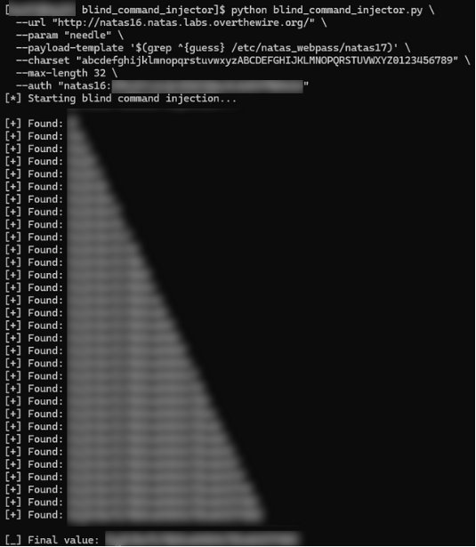

# blind_command_injector

`blind_command_injector` is an educational tool designed to demonstrate how **blind command injection vulnerabilities** can be exploited in controlled environments. It focuses on understanding *how* information leaks occur when a system executes user-controlled input inside shell commands.

This project is intended for learning, analysis, and defensive security research only.

---

## Overview

The tool illustrates how:

- User input can reach a shell execution context
- Output differences (even when not visible) can leak information
- A secret can be reconstructed one character at a time
- Command injection does not require direct output access

It is designed to model the *logic* of exploitation rather than automate real-world attacks.

---

## Conceptual model

The vulnerable program:

1. Accepts user input
2. Inserts it into a shell command
3. Executes that command
4. Returns the command’s output

Because shell expansion happens before execution, user input can influence how the command behaves.

The application does not explicitly reveal secrets, but it does reveal **whether a command produced output or not**, which is enough to infer information indirectly.

---

## Why this works

The application leaks information through behavior:

- When a condition is true, output is produced
- When it is false, no output is produced

This difference acts as a binary signal.

By carefully crafting inputs and observing the presence or absence of output, it is possible to reconstruct unknown values one character at a time.

This is an example of a **side-channel vulnerability**.

---

## What the tool does

The tool:

1. Sends controlled input to a vulnerable endpoint
2. Observes whether output is returned
3. Interprets that result as a boolean signal
4. Repeats the process to infer a hidden value incrementally

At no point does it directly read or display protected data.

---

## What this tool is not

- It is not a general-purpose exploit framework
- It is not intended for use against production systems
- It does not bypass authentication on its own
- It does not exploit memory corruption or buffer overflows

---

## Intended use

This project exists for:

- Learning how command injection vulnerabilities work
- Understanding side-channel information leaks
- Practicing secure coding and defensive analysis
- Educational CTF-style environments

---

## Ethical note

This project should only be used on systems you own or have explicit permission to test.

Unauthorized use against live systems is unethical and illegal.

---

## Summary

This tool demonstrates how seemingly harmless behavior, like printing or not printing output., can leak sensitive information when user input is mishandled. It exists to help developers and security learners understand *why* such vulnerabilities occur and how to prevent them.

---

## Author

Jeremy Ray Jewell  
GitHub: https://github.com/jeremyrayjewell  
LinkedIn: https://www.linkedin.com/in/jeremyrayjewell
