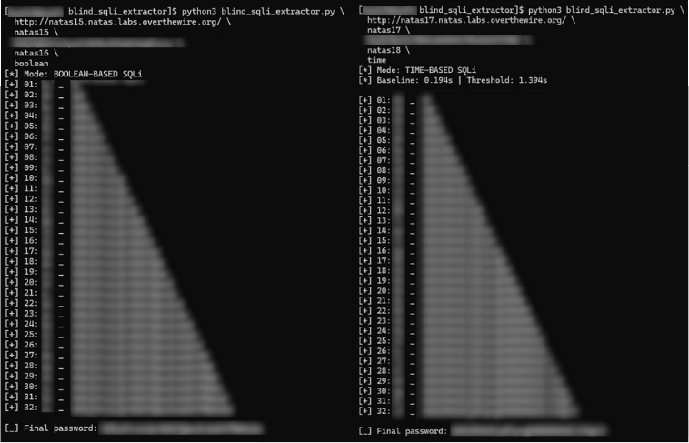

# blind_sqli_extractor

A reusable blind SQL injection automation tool designed for controlled security testing and educational use.
This script was developed while solving OverTheWire – Natas Level 15, and is written to be reusable for other
boolean-based blind SQL injection scenarios.

---

## Overview

Many vulnerable applications do not return query results directly. Instead, they reveal whether a condition
is true or false through subtle response differences. This tool exploits that behavior to extract sensitive
values one character at a time.

The goal is clarity, reusability, and correctness.

---

## How It Works

1. A crafted SQL payload is injected into a vulnerable parameter.
2. The payload checks whether a specific character at a given position matches the expected value.
3. The application’s response reveals whether the condition evaluated to true.
4. The script iterates through characters until the full value is recovered.

---

## Usage

python3 blind_sqli_extractor.py \
  --url "http://natas15.natas.labs.overthewire.org/" \
  --user natas15 \
  --password <NATAS15_PASSWORD> \
  --param username \
  --true-string "This user exists" \
  --max-length 32

---

## Arguments

--url         Target URL  
--user        HTTP authentication username  
--password    HTTP authentication password  
--param       Vulnerable request parameter  
--true-string String indicating a TRUE condition  
--max-length  Maximum number of characters to extract  

---

## Use Case

This tool was used to solve OverTheWire Natas Level 15, where the application reveals only a boolean response
indicating whether a SQL condition is true. By iterating through possible characters, the password for the
next level can be reconstructed.

---

## Ethical Notice

This tool is intended solely for educational use and authorized security testing.
Do not use it against systems you do not own or have permission to test.

---

## Author

Jeremy Ray Jewell  
GitHub: https://github.com/jeremyrayjewell  
LinkedIn: https://www.linkedin.com/in/jeremyrayjewell
