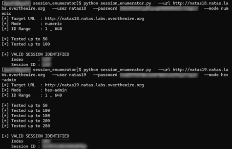

# session_enumerator

A lightweight Python utility for enumerating predictable session identifiers in web applications.

Designed for educational use, CTF challenges, and authorized security testing, this tool identifies insecure session management by testing predictable session values rather than brute-forcing credentials.



---

## Overview

`session_enumerator` targets applications that rely on weak or deterministic session identifiers.
Instead of attacking authentication directly, it attempts to reuse or predict session IDs that may grant elevated access (e.g., admin sessions).
This class of vulnerability commonly appears when:
- Session IDs are sequential or low-entropy
- Session values are derived from predictable input
- The application trusts client-supplied session identifiers

---

## How It Works

The tool performs the following steps:
- Iterates through a range of candidate session identifiers
- Injects each value as a session cookie
- Sends an authenticated HTTP request
- Inspects the response for a success indicator
- Stops immediately when a valid session is discovered
This avoids password brute-forcing and instead exploits flawed session management logic.

### Supported Session Modes

| Mode        | Description                                          |
| ----------- | ---------------------------------------------------- |
| `numeric`   | Sequential numeric session IDs (e.g. `1`, `2`, `3`)  |
| `hex-admin` | Hex-encoded session values derived from `<id>-admin` |

Additional modes can be added easily.

---

## Usage

```
python session_enumerator.py \
  --url http://target.example.com \
  --user username \
  --password password \
  --mode numeric
```
---

## Command-Line Options

| Option       | Description                                          |
| ------------ | ---------------------------------------------------- |
| `--url`      | Target application URL                               |
| `--user`     | HTTP authentication username                         |
| `--password` | HTTP authentication password                         |
| `--mode`     | Session generation mode (`numeric`, `hex-admin`)     |
| `--start`    | Starting session ID (default: `1`)                   |
| `--end`      | Ending session ID (default: `640`)                   |
| `--delay`    | Delay between requests in seconds                    |
| `--match`    | Response string indicating successful authentication |

---

## Ethical Notice

This tool is intended solely for educational use and authorized security testing.
Do not use it against systems you do not own or have permission to test.

---

## Author

Jeremy Ray Jewell  
GitHub: https://github.com/jeremyrayjewell  
LinkedIn: https://www.linkedin.com/in/jeremyrayjewell
