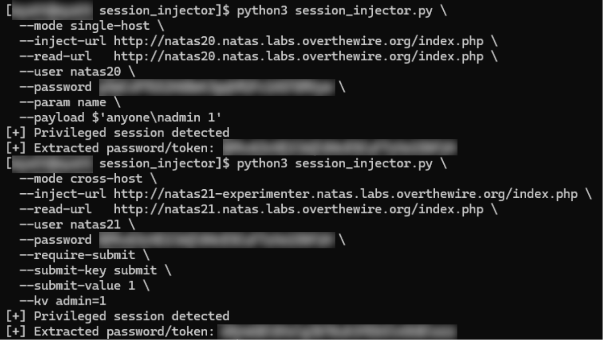

# session_injector
Targets applications that trust user-influenced session storage and illustrates how session poisoning can lead to full authentication bypass.



---

## Overview

`session_injector` is a targeted security testing utility designed to exploit insecure server-side session handling. It demonstrates how improperly validated session data can be manipulated to escalate privileges without authentication.

The tool is intended for educational use, CTF challenges, and controlled security research environments where session state is stored insecurely and trusted without validation.

---

## How It Works

The tool exploits applications that store session data in a server-side file or structure without sanitizing user-supplied input. The attack flow is:
- Establish a valid session with the target application.
- Inject crafted session data using a controlled request.
- Abuse the server’s session deserialization logic to introduce privileged session variables.
- Reuse the same session to gain elevated access.
Unlike brute-force or enumeration techniques, this approach exploits session poisoning, where application trust boundaries are violated by unsafe state handling.

---

## Usage

```
python session_injector.py \
  --url http://target.example.com \
  --user username \
  --password password
```
The tool will:
- Create a valid session
- Inject a crafted payload into the session
- Reuse the same session to test for elevated privileges
- Display confirmation if administrative access is achieved

---

## Command-Line Options

| Option           | Description                              |
| ---------------- | ---------------------------------------- |
| `--url`          | Target application URL                   |
| `--user`         | HTTP authentication username             |
| `--password`     | HTTP authentication password             |
| `--name-payload` | Custom payload injected into the session |
| `--timeout`      | Request timeout (seconds)                |
| `--verbose`      | Enable verbose output for debugging      |


---

## Ethical Notice

This tool is intended solely for educational use and authorized security testing.
Do not use it against systems you do not own or have permission to test.

---

## Author

Jeremy Ray Jewell  
GitHub: https://github.com/jeremyrayjewell  
LinkedIn: https://www.linkedin.com/in/jeremyrayjewell
